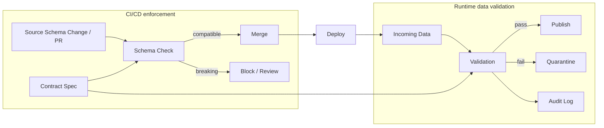
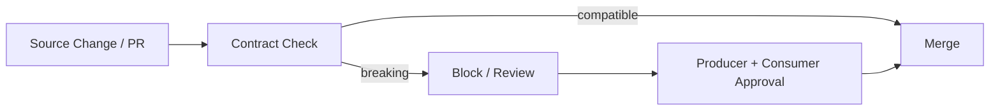

# Data Contracts in Action

Repo นี้เป็นตัวอย่างแบบ **simple** สำหรับอธิบายแนวคิด **Data Contract** ผ่าน demo เล็ก ๆ ที่จำลอง 2 จุดสำคัญของการ enforce contract ได้แก่ **CI/CD schema check** และ **runtime data validation** แบบ **Write-Audit-Publish (WAP)**

เป้าหมายคือทำให้ concept สำคัญของ Data Contract เห็นภาพแบบ end-to-end ใน scale ที่เล็กพอให้อ่านง่าย รันได้จริง และต่อยอดได้ในอนาคต

## What is a data contract?

**Data Contract** คือข้อตกลงระหว่าง **Data Producer** กับ **Data Consumer** ว่า data asset สำคัญควรมี schema, business meaning, quality rule, SLA, owner และ change policy อย่างไร

จุดสำคัญคือ Data Contract ไม่ควรเป็นแค่เอกสารที่คนอ่านได้อย่างเดียว แต่ควรเป็น spec ที่ machine-readable และสามารถนำไป enforce ได้ผ่าน CI/CD pipeline หรือ data pipeline

พูดง่าย ๆ คือ:

> Data Contract = ข้อตกลงที่เขียนในรูปแบบ code เพื่อกำหนด expectation ระหว่าง upstream กับ downstream และสามารถนำไป enforce ได้จริง

## Conceptual flow



Diagram นี้แสดงให้เห็นว่า `Contract Spec` เดียวกันสามารถนำไปใช้ได้ 2 จุดหลัก:

* **CI/CD enforcement**: ตรวจ schema change ก่อน merge เพื่อช่วยป้องกัน breaking change
* **Runtime data validation**: ตรวจ incoming data ก่อน publish, แยกข้อมูลที่ไม่ผ่านไป quarantine และบันทึก audit log

## Repository structure

```text
data-contracts-in-action/
├── .github/
│   └── workflows/
│       └── contract-check.yml
├── actual_schemas/
│   ├── customer_profile.actual.breaking.json
│   └── customer_profile.actual.ok.json
├── contracts/
│   └── customer_profile.contract.json
├── samples/
│   └── customer_profile_input.csv
├── scripts/
│   └── data_contract_demo.py
├── .gitignore
├── LICENSE
└── README.md
```

## What this demo covers

ใน demo นี้เราจะใช้ data asset ตัวอย่างชื่อ `customer_profile` เพื่อจำลองว่า contract สามารถกำหนด expected schema, required fields, allowed values และ action เมื่อข้อมูลไม่ผ่าน validation ได้อย่างไร

1. **Contract spec**
   เก็บ expectation ของ data asset ไว้ใน `contracts/customer_profile.contract.json`

2. **Schema check**
   เอา contract ไปเทียบกับ schema จริงจาก source system เพื่อ detect breaking change เช่น rename `customer_id` เป็น `customer_key` หรือเปลี่ยน type ของ `status`

3. **CI/CD check**
   มี GitHub Actions workflow ที่รัน schema check อัตโนมัติ เพื่อแสดงว่า contract check สามารถถูกนำไปใช้ใน pull request / merge flow ได้

4. **Write-Audit-Publish (WAP)**
   จำลอง runtime validation โดย publish record ที่ผ่าน contract, ส่ง record ที่ไม่ผ่านไป quarantine และเขียน audit log

## CI/CD schema check

แนวคิดคือในระบบจริง contract check สามารถถูกใช้เป็น quality gate ก่อน merge หรือ deploy ได้ เพื่อช่วยลดโอกาสที่ schema change จะกระทบ downstream แบบไม่รู้ตัว

### Preview the check locally

ส่วนนี้ใช้ Python standard library เท่านั้น จึงไม่ต้องติดตั้ง package เพิ่ม

ลองรัน schema check กับ schema ที่ compatible กับ contract:

```bash
python scripts/data_contract_demo.py schema-check \
  --contract contracts/customer_profile.contract.json \
  --schema actual_schemas/customer_profile.actual.ok.json
```

ผลลัพธ์ที่คาดหวัง:

```text
Schema check passed
```

ลองรันกับ schema ที่เป็น breaking change:

```bash
python scripts/data_contract_demo.py schema-check \
  --contract contracts/customer_profile.contract.json \
  --schema actual_schemas/customer_profile.actual.breaking.json
```

ผลลัพธ์ที่คาดหวัง: script จะ fail และบอกว่า schema ไม่ตรงกับ contract เช่น missing required column หรือ type mismatch

### Automate the check with GitHub Actions

ส่วนนี้ใช้ GitHub Actions workflow ที่อยู่ใน `.github/workflows/contract-check.yml` เพื่อแสดงว่า contract check สามารถถูกนำไปใช้ใน pull request / merge flow ได้

Workflow นี้จะรันอัตโนมัติเมื่อมี `pull_request` หรือ `push` เข้า `main`

ถ้าต้องการสั่งรัน workflow เองผ่าน GitHub CLI ต้องติดตั้ง GitHub CLI (`gh`) และล็อกอินกับ GitHub ไว้ก่อน

ตัวอย่างสำหรับ macOS ที่ใช้ Homebrew:

```bash
brew install gh
gh auth login
```

จากนั้นใช้คำสั่งนี้เพื่อ trigger workflow:

```bash
gh workflow run contract-check.yml --ref main
```

หลังจากสั่งรันแล้ว สามารถดูผลได้ที่แท็บ **Actions** ของ GitHub repo แล้วเลือก workflow ชื่อ **Contract check**

## Runtime data validation with WAP

ส่วนนี้จำลองการ validate ข้อมูลตอน runtime ตามแนวคิด Write-Audit-Publish (WAP)

Script จะอ่าน sample input, validate กับ contract, publish record ที่ผ่าน, ส่ง record ที่ไม่ผ่านไป quarantine และเขียน audit log

```bash
python scripts/data_contract_demo.py data-validate \
  --contract contracts/customer_profile.contract.json \
  --input samples/customer_profile_input.csv
```

หลังรันจะได้ output ประมาณนี้:

```text
output/
├── published/
│   └── customer_profile.csv
├── quarantine/
│   └── customer_profile_invalid.csv
└── audit/
    └── validation_log.json
```

ความหมายคือ:

* `published/` = record ที่ผ่าน contract และพร้อมให้ downstream ใช้ต่อ
* `quarantine/` = record ที่ไม่ผ่าน contract พร้อมเหตุผลของ violation
* `audit/` = log สรุปจำนวน record, valid/invalid count และ violation summary

## Change management flow



แนวคิดคือ producer ไม่ควรเปลี่ยน schema สำคัญแล้ว merge change เงียบ ๆ โดยที่ consumer ไม่รู้ หาก contract check พบว่าเป็น breaking change ควรมีขั้นตอน review และ approval จากทั้งฝั่ง producer และ consumer ก่อนนำ change นั้นไปใช้จริง

## Notes

โปรเจกต์นี้เป็น repo สำหรับเรียนรู้และสาธิตแนวคิด Data Contract จากมุมมองของผู้จัดทำ โดยได้รับแรงบันดาลใจจากหนังสือ [*Data Contracts*](https://www.oreilly.com/library/view/data-contracts/9781098157623/) ของ Chad Sanderson, Mark Freeman และ B.E. Schmidt

เนื้อหา ตัวอย่าง และโค้ดใน repo นี้ถูกเขียนขึ้นใหม่เพื่อการเรียนรู้ ไม่ใช่เนื้อหาทางการจาก O’Reilly หรือผู้เขียนหนังสือ